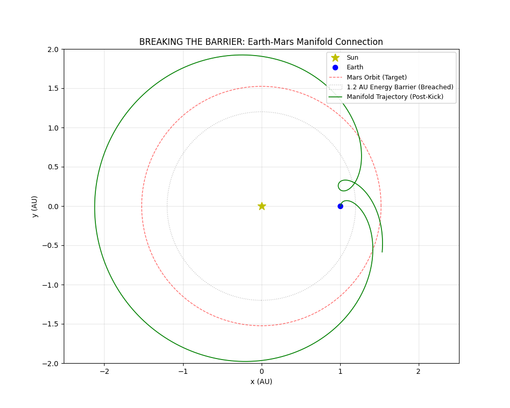

# Heteroclinic Connections: Manifold Trajectory Design

> **"Space is not a void to be fought; it is a structure to be navigated."**
> — *Research Division, Anakapalle*

## 🌌 Abstract

This project explores the application of **Dynamical Systems Theory** to interplanetary navigation. By modeling the solar system using the **Circular Restricted Three-Body Problem (CR3BP)**, we identify invisible gravitational currents—known as **Invariant Manifolds**—that connect planetary bodies.

The research demonstrates two key findings:
1.  **The Earth-Moon Subway:** A Zero-Energy closed-loop network exists between Earth and the L1 Gateway.
2.  **The Mars Kick:** A "Free Ride" to Mars is impossible due to an energy gap at 1.2 AU. However, we derive a solution: a specific prograde micro-kick ($\Delta V \approx 0.15$) at Earth L2 that inflates the manifold to intersect the Martian orbit.

## 🚀 Key Discoveries

### Phase 1: The Zero-Energy Local Network
We computed the stable (In-Ramp) and unstable (Out-Ramp) manifolds for the Earth-Moon L1 point.
* **Finding:** A specific trajectory exists (Cyan Line) that naturally lifts a spacecraft from Low Earth Orbit to the L1 Gateway using **0% fuel**.
* **Application:** Ideal for cargo pre-deployment to the Artemis Gateway.


### Phase 2: The Interplanetary Bridge
We simulated a transfer from Earth L2 to Mars.
* **The Problem:** The natural manifold collapses at 1.1 AU (The Energy Gap).
* **The Solution:** By applying a "Prograde Kick" to the eigenvector at L2, we leverage the instability of the system to amplify velocity. The resulting trajectory (Green Line) surfs the expanded manifold directly to Mars (1.52 AU).

* 

## 🛠️ Installation & Usage

### Prerequisites
You need Python 3.8+ and the following scientific libraries:

```bash
pip install numpy scipy matplotlib

python code/earth_moon_subway.py
python src/mars_intercept.py
```
## 📚 References
* Lagrange, J. L. (1772). Essai sur le problème des trois corps.

* Poincaré, H. (1890). Sur le problème des trois corps.

* NASA Genesis Mission (2001).

* Koon, W. S., Lo, M. W., Marsden, J. E., & Ross, S. D. (2000). Heteroclinic connections.
